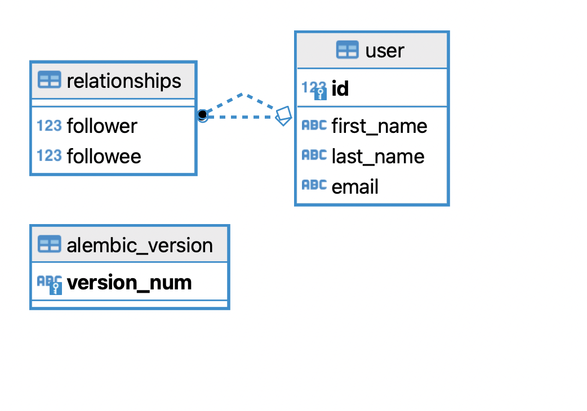

# README

# Database ER diagram


# Follow up questions
1. What are potential pitfalls when expanding on your solution?
Limitations:
- the hardware on which the application, along with the database, is deployed
- it is not possible to have asynchronous communication between the database and the application (no async driver for sqlite)

2. How big would your solution scale to, and what would you do at that point?

My solution's scaling capability is very much limited by the hardware on which it is run. When it reaches a point where the time it takes to process a request or requests are dropped, I would refactor my solution: I would deploy the application on one machine, and would deploy the database on a different machine. Moreover, I would replace the sqlite database with a postgresql database, use "asyncpg" as my database driver, and make the endpoint asynchronous.

If further scaling is needed, the application can be deployed on a cluster with a load balancer in front, as the app is stateless, so it can be "replicated freely". As for the database, I would employ the "master/slave replication" pattern, as the application is a "read-heavy"; the app reads data more frequently. This solution would come at the cost of consistency; it takes time to propagate changes to data to the "slave" instances.

Lastly, I did not mention the most straight forward solution for "slow app". When the application performs below the "acceptable level", I could just deploy the whole setup on a machine with more CPU, RAM, and storage. However, this is not a sustainable solution, therefore I would prefer not to do this.


3. How would you modify your implementation to support other types of followers than just Users?

*What would I do to allow brands to follow users?*
I would create an Enum called UserType, then I would add a column to the User table, called user_type, that is of type UserType. No further modification is necessary.

```python
class UserType(enum.IntEnum):
    person = 1
    brand = 2

class User(Base):
    # all the existing fields
    user_type = Column(Enum(UserType))
```


# Run demo
```console
git clone git@github.com:andrasnagy-data/server.git
cd server
```

**With poetry:**
```console
poetry install
poetry update
poetry run alembic upgrade head
poetry run uvicorn server.main:app
```

**Without poetry:**
```console
python -m venv .venv
source .venv/bin/activate
pip install -r requirements.txt
alembic upgrade head
python uvicorn server.main:app
```

Open a browser and navigate to: http://127.0.0.1:8000/docs (there are 4 users in the database!)

# Clean up
```console
cd ..
rm -f -r server
```
