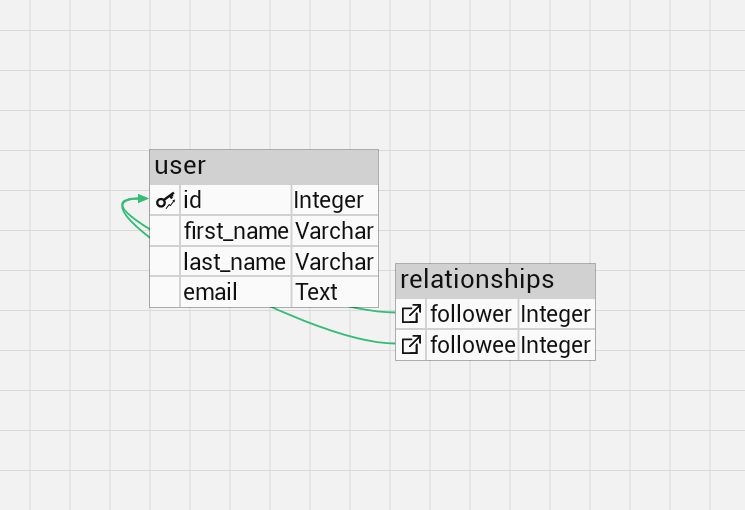

# Python web app
FastAPI web application (based on a sqlite db) with an endpoint that shows a user's followers.

# Database schema


# Follow up questions
1. What are potential pitfalls when expanding on your solution?

One pitfall is the fact, that the domain points directly to the web server (not to a load balancer). Another pitfall is the fact, that it is not possible to scale "components" separately (e.g. scale only the database "component"). Currently, the size of the application is not a problem, but as/when the project grows, the size can become a problem: slower deployment. Moreover, it is important to mention that the project relies on third-party libraries, therefore, any error (highly unlikely, as the libraries are well maintained and tested) can introduce errors in the project. Lastly, "code base complexity" can become an issue when expanding monolithic applications.

2. How big would your solution scale to, and what would you do at that point?

As mentioned above, the application architecture is a major limiting factor of scaling. However, if the app was deployed as a managed cloud service (e.g. on Google Cloud Run) with a load balancer (so that horizontal scaling is possible), the solution could (auto-)scale reasonably. Another limiting factor is the fact that one database serves the application. In the case when the database was "over-loaded", and I exhausted all the "typical" optimizing steps (optimizing queries, caching query results) without an acceptable improvement, I would create read replica(s) of the database. The price of this approach is that the data returned could be lacking some -newly added- information. However, if the data must be correct, I would query the main database.
Lastly, if needed, the database could be factored out into a service on its own. Then, the two services could be scaled independently, according to their load.

3. How would you modify your implementation to support other types of followers than just Users?

*What would I do to allow brands to follow users?* I would create an Enum called UserType, then I would add a column to the User table, called user_type, that is of type UserType.
```python
class UserType(enum.IntEnum):
    person = 1
    brand = 2

class User(Base):
    # all the existing attributes
    user_type = Column(Enum(UserType))
```


# Run demo
```console
git clone git@github.com:andrasnagy-data/server.git
cd server
```

**With poetry:**
```console
poetry install
poetry update
poetry run alembic upgrade head
poetry run uvicorn server.main:app
```

**Without poetry:**
```console
python -m venv .venv
source .venv/bin/activate
pip install -r requirements.txt
alembic upgrade head
python uvicorn server.main:app
```

Open a browser and navigate to: http://127.0.0.1:8000/docs (there are 4 users in the database!)

# Clean up
```console
cd ..
rm -f -r server
```
